# Digital portfolio Embedded systems Y1 P3
-  Name: Peter Kapsiar
- Student ID: 5486866
- Repository: https://github.com/pop9459/P3-EmbeddedSystems/

## Blink with hardware reset
### Description
This is a simple test that blinks an LED on and off. With this we can verify that the microcontroller works properly. The code first imports the libraries for pin controll and time functions. It defines the output pins for the LEDs. In this case I used one external LED and also the picos built in LED. After that it just enters in a loop where it turns the leds on and off with some delays in between.

### Code
`main.py`
```python
from machine import Pin
import utime

led_builtin = Pin("LED", Pin.OUT)
led_external = Pin(15, Pin.OUT)

while True:
    led_builtin.high()
    led_external.high()
    utime.sleep_ms(200)
    
    led_builtin.low()
    led_external.low()
    utime.sleep_ms(800)
```
### Schematic
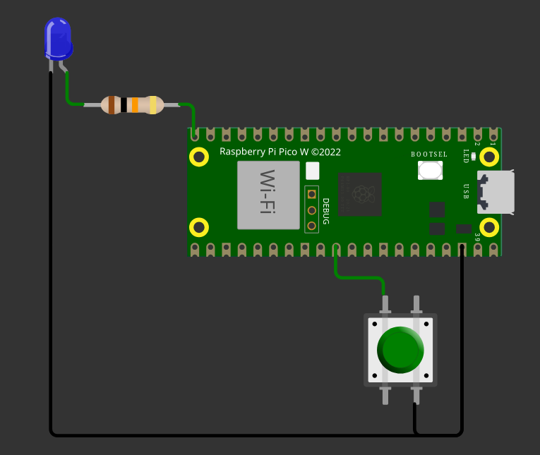

### Output
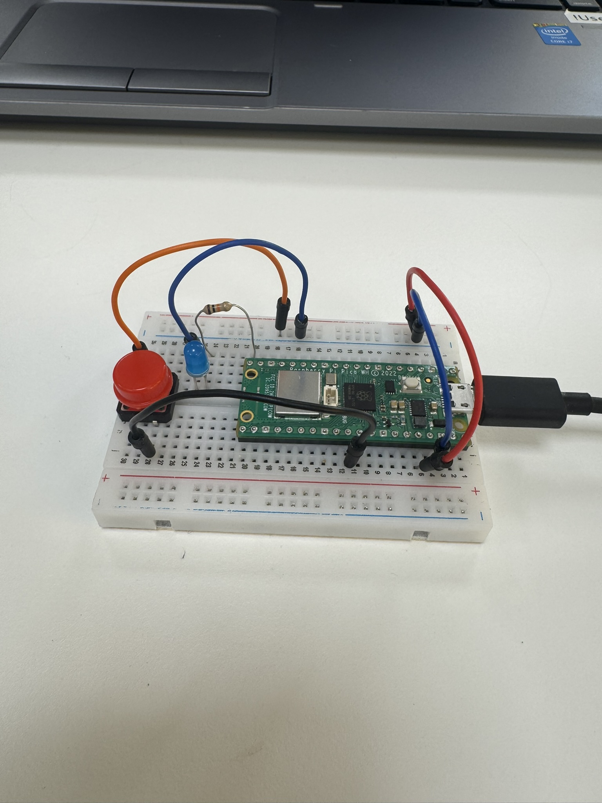

## Mario pico

### Description
A short practice program that draws a pyramid shape to the output terminal using printable characters. It defines one variable at the begining which controlls the size of the pyramid drawing. For the first pyramid I just use a single character. It starts drawing it from the top so each line will get N "#" symbols on the N-th line. The second pyramid works on the same principle but prints diffenet symbols based on if it is printing the edge of the pyramid or the middle part 

### Code
`main.py`
```python
pyramidSize = 10

for y in range(pyramidSize):
    for x in range(pyramidSize):
        if x < pyramidSize - y - 1:
            print(" ", end="")
        else:
            print("# ", end="")
    print()

for y in range(pyramidSize):
    for x in range(pyramidSize):
        if x < pyramidSize - y - 1:
            print(" ", end="")
        else:
            if y == 0:
                print("^", end="")
            elif x == pyramidSize - y - 1:
                print("/#", end="")
            elif x == pyramidSize - 1:
                print("\\ ", end="")
            else:
                print("##", end="")
    print()

```

### Schematic
Not applicable for this project since it only prints to the console.

### Output


## 7-Segments Voltmeter (0..10V)

### Description
TODO

### Code
`main.py`
```python
from segment_display import Display
from machine import Pin, ADC
import time

# Display pin definitions
DISPLAY_DIGIT_1_PIN = 2
DISPLAY_DIGIT_2_PIN = 3
DISPLAY_DIGIT_3_PIN = 4
DISPLAY_DIGIT_4_PIN = 5
DISPLAY_SEGMENT_A_PIN = 6
DISPLAY_SEGMENT_B_PIN = 7
DISPLAY_SEGMENT_F_PIN = 8
DISPLAY_SEGMENT_E_PIN = 16
DISPLAY_SEGMENT_D_PIN = 17
DISPLAY_SEGMENT_C_PIN = 18
DISPLAY_SEGMENT_G_PIN = 19
DISPLAY_SEGMENT_DP_PIN = 20

# Voltmeter pin definition
VOLT_METER_PIN = 26
VOLTAGE_DIVIDER_RATIO = 3.127659574 # Calculated as (R1 + R2) / R2, where R1 = 10kΩ and R2 = 4.7kΩ

# Initialize the display
display = Display(
    DISPLAY_DIGIT_1_PIN,
    DISPLAY_DIGIT_2_PIN,
    DISPLAY_DIGIT_3_PIN,
    DISPLAY_DIGIT_4_PIN,
    DISPLAY_SEGMENT_A_PIN,
    DISPLAY_SEGMENT_B_PIN,
    DISPLAY_SEGMENT_C_PIN,
    DISPLAY_SEGMENT_D_PIN,
    DISPLAY_SEGMENT_E_PIN,
    DISPLAY_SEGMENT_F_PIN,
    DISPLAY_SEGMENT_G_PIN,
    DISPLAY_SEGMENT_DP_PIN,
)

# Initialize the voltmeter
voltmeter = ADC(Pin(VOLT_METER_PIN, Pin.IN))

# Main loop variables
update_delay_ms = 250
next_update_time = time.ticks_ms()
voltage = 0

while True:
    current_time = time.ticks_ms()

    display.write_value(voltage*100, dp=1)

    if time.ticks_diff(current_time, next_update_time) >= 0:
        voltage = (voltmeter.read_u16() / 65535) * 3.3 * VOLTAGE_DIVIDER_RATIO # Convert the ADC reading to a voltage value
        print(voltage)

        next_update_time = time.ticks_add(current_time, update_delay_ms)
```

`segment_display.py`
```python
from machine import Pin
import time

DIGITS = [
    # .GFEDCBA
    0b00111111, # 0
    0b00000110, # 1
    0b01011011, # 2
    0b01001111, # 3
    0b01100110, # 4
    0b01101101, # 5
    0b01111101, # 6
    0b00000111, # 7
    0b01111111, # 8
    0b01101111, # 9
]

class Display():
    digit_pins = []
    segment_pins = []
    digit_time_on_us = 500
    digit_time_off_us = 100
    
    def __init__(self, DIGIT_1_PIN, DIGIT_2_PIN, DIGIT_3_PIN, DIGIT_4_PIN, SEGMENT_A_PIN, SEGMENT_B_PIN, SEGMENT_C_PIN, SEGMENT_D_PIN, SEGMENT_E_PIN, SEGMENT_F_PIN, SEGMENT_G_PIN, SEGMENT_DP_PIN):
        self.digit_pins = [
            Pin(DIGIT_1_PIN, Pin.OUT),
            Pin(DIGIT_2_PIN, Pin.OUT),
            Pin(DIGIT_3_PIN, Pin.OUT),
            Pin(DIGIT_4_PIN, Pin.OUT),
        ]

        self.segment_pins = [
            Pin(SEGMENT_A_PIN, Pin.OUT),
            Pin(SEGMENT_B_PIN, Pin.OUT),
            Pin(SEGMENT_C_PIN, Pin.OUT),
            Pin(SEGMENT_D_PIN, Pin.OUT),
            Pin(SEGMENT_E_PIN, Pin.OUT),
            Pin(SEGMENT_F_PIN, Pin.OUT),
            Pin(SEGMENT_G_PIN, Pin.OUT),
            Pin(SEGMENT_DP_PIN, Pin.OUT),
        ]
        
    def write_value(self, value, dp=-1):
        # Convert the value to an integer and clamp it to the range 0-9999
        value = max(0, min(9999, value))
        value = int(value)

        for digit_index in range(4):
            dp_enable = (dp == digit_index)
            digit_value = (value // (10 ** (3 - digit_index))) % 10
            self.set_digit(digit_index, digit_value, dp=dp_enable)

    def set_digit(self, digit_index, digit_value, dp=False):
        # Set the common cathode
        for index in range(len(self.digit_pins)):
            digit_on = index == digit_index
            self.digit_pins[index].value(digit_on)

        # Set the segments for the digit
        for index in range(len(self.segment_pins)):
            segment_on = (DIGITS[digit_value] >> index) & 1
            self.segment_pins[index].value(segment_on)
        self.segment_pins[7].value(dp)

        time.sleep_us(self.digit_time_on_us)

        # Turn off all digits to reduce ghosting
        for index in range(len(self.segment_pins)):
            self.segment_pins[index].value(0)

        time.sleep_us(self.digit_time_off_us)
```

### Schematic
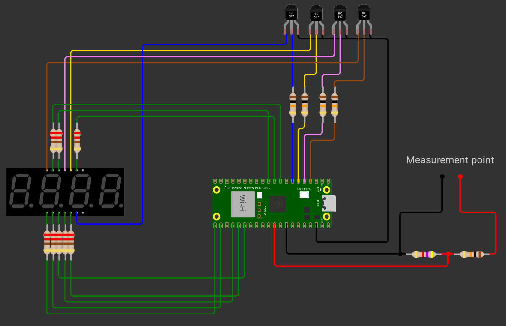

### Output


## RTC and temperature on LCD-display

### Description

### Code
`main.py`
```python
from machine import Pin, SoftI2C, I2C, ADC
from machine_i2c_lcd import I2cLcd
import time
import ds1302

# RTC constants
RTC_CLK_PIN = 5
RTC_DAT_PIN = 7
RTC_RST_PIN = 8

# I2C LCD constants
I2C_NUM_ROWS = 2
I2C_NUM_COLS = 16

LCD_SDA_PIN = 16
LCD_SCL_PIN = 17

# RTC initialization
rtc_module = ds1302.DS1302(Pin(RTC_CLK_PIN), Pin(RTC_DAT_PIN), Pin(RTC_RST_PIN))

# LCD initialization
i2c = I2C(0, scl=Pin(LCD_SCL_PIN), sda=Pin(LCD_SDA_PIN), freq=400000)
devices = i2c.scan()

i2c_addr = None
for d in devices:
    if d in range(0x20, 0x28):  # PCF8574 I2C address range
        print(f"Setting i2c address: {hex(d)}")
        i2c_addr = d
        break

lcd = I2cLcd(i2c, i2c_addr, I2C_NUM_ROWS, I2C_NUM_COLS)
lcd.backlight_on()
lcd.hide_cursor()
lcd.clear()

# LM35 initialization
LM35 = ADC(Pin(26)) 

# set the rtc module
#rtc_module.date_time([2026, 3, 8, 7, 19, 50, 0]) # format: [year, month, day, weekday, hour, minute, second]

# Main loop variables
current_time = time.time()
tmp_read_update_interval = 3  # seconds
next_tmp_read_time = current_time # Read temp every 10 seconds

rtc_update_interval = 1  # seconds
next_rtc_update_time = current_time  # Update RTC display every second

lcd_update_interval = 0.5  # seconds
next_lcd_update_time = current_time# Update LCD every second

try:
    while True:
        current_time = time.time()

        # Get data from temp sensor
        if current_time >= next_tmp_read_time:
            LM35raw = LM35.read_u16()
            LM35temp = (LM35raw / 65535) * 3.3 * 100  # Convert to Celsius

            next_tmp_read_time = current_time + tmp_read_update_interval 

        # Get data from DS1302 RTC
        if current_time >= next_rtc_update_time:
            date_time = rtc_module.date_time()

            next_rtc_update_time = current_time + rtc_update_interval

        # Debug print
        # if date_time is not None:
        #     print(f"Current Date and Time: {date_time[2]:02d}.{date_time[1]:02d}.{date_time[0]:04d} {date_time[4]:02d}:{date_time[5]:02d}:{date_time[6]:02d}")
        # else:
        #     print("Current Date and Time: unavailable")

        # Display on LCD
        if current_time >= next_lcd_update_time:
            if date_time is not None:
                lcd.move_to(0, 0)
                lcd.putstr(f"{date_time[2]:02d}.{date_time[1]:02d}.  {date_time[4]:02d}:{date_time[5]:02d}:{date_time[6]:02d}")
            
            lcd.move_to(0, 1)
            lcd.putstr(f"Temp: {LM35temp:02.1f}C")

            next_lcd_update_time = current_time + lcd_update_interval

except KeyboardInterrupt:
    print("Exiting program.")
    lcd.backlight_off()
```
#### External libraries used:
- LCD API library: https://github.com/dhylands/python_lcd/blob/master/lcd/lcd_api.py
- Machine I2C LCD library: https://github.com/dhylands/python_lcd/blob/master/lcd/machine_i2c_lcd.py
- ds1302 Real Time Clock library: https://github.com/omarbenhamid/micropython-ds1302-rtc/blob/master/ds1302.py

### Schematic
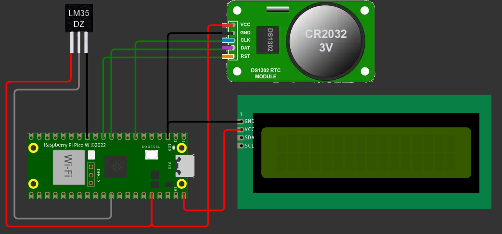

### Output
 

## Dino cheater (HID)

### Description

### Code
```python
from machine import Pin, SoftI2C, I2C, ADC
from machine_i2c_lcd import I2cLcd
import time
import ds1302

# RTC constants
RTC_CLK_PIN = 5
RTC_DAT_PIN = 7
RTC_RST_PIN = 8

# I2C LCD constants
I2C_NUM_ROWS = 2
I2C_NUM_COLS = 16

LCD_SDA_PIN = 16
LCD_SCL_PIN = 17

# RTC initialization
rtc_module = ds1302.DS1302(Pin(RTC_CLK_PIN), Pin(RTC_DAT_PIN), Pin(RTC_RST_PIN))

# LCD initialization
i2c = I2C(0, scl=Pin(LCD_SCL_PIN), sda=Pin(LCD_SDA_PIN), freq=400000)
devices = i2c.scan()

i2c_addr = None
for d in devices:
    if d in range(0x20, 0x28):  # PCF8574 I2C address range
        print(f"Setting i2c address: {hex(d)}")
        i2c_addr = d
        break

lcd = I2cLcd(i2c, i2c_addr, I2C_NUM_ROWS, I2C_NUM_COLS)
lcd.backlight_on()
lcd.hide_cursor()
lcd.clear()

# LM35 initialization
LM35 = ADC(Pin(26)) 

# set the rtc module
#rtc_module.date_time([2026, 3, 8, 7, 19, 50, 0]) # format: [year, month, day, weekday, hour, minute, second]

# Main loop variables
current_time = time.time()
tmp_read_update_interval = 3  # seconds
next_tmp_read_time = current_time # Read temp every 10 seconds

rtc_update_interval = 1  # seconds
next_rtc_update_time = current_time  # Update RTC display every second

lcd_update_interval = 0.5  # seconds
next_lcd_update_time = current_time# Update LCD every second

try:
    while True:
        current_time = time.time()

        # Get data from temp sensor
        if current_time >= next_tmp_read_time:
            LM35raw = LM35.read_u16()
            LM35temp = (LM35raw / 65535) * 3.3 * 100  # Convert to Celsius

            next_tmp_read_time = current_time + tmp_read_update_interval 

        # Get data from DS1302 RTC
        if current_time >= next_rtc_update_time:
            date_time = rtc_module.date_time()

            next_rtc_update_time = current_time + rtc_update_interval

        # Debug print
        # if date_time is not None:
        #     print(f"Current Date and Time: {date_time[2]:02d}.{date_time[1]:02d}.{date_time[0]:04d} {date_time[4]:02d}:{date_time[5]:02d}:{date_time[6]:02d}")
        # else:
        #     print("Current Date and Time: unavailable")

        # Display on LCD
        if current_time >= next_lcd_update_time:
            if date_time is not None:
                lcd.move_to(0, 0)
                lcd.putstr(f"{date_time[2]:02d}.{date_time[1]:02d}.  {date_time[4]:02d}:{date_time[5]:02d}:{date_time[6]:02d}")
            
            lcd.move_to(0, 1)
            lcd.putstr(f"Temp: {LM35temp:02.1f}C")

            next_lcd_update_time = current_time + lcd_update_interval

except KeyboardInterrupt:
    print("Exiting program.")
    lcd.backlight_off()
```

### Schematic
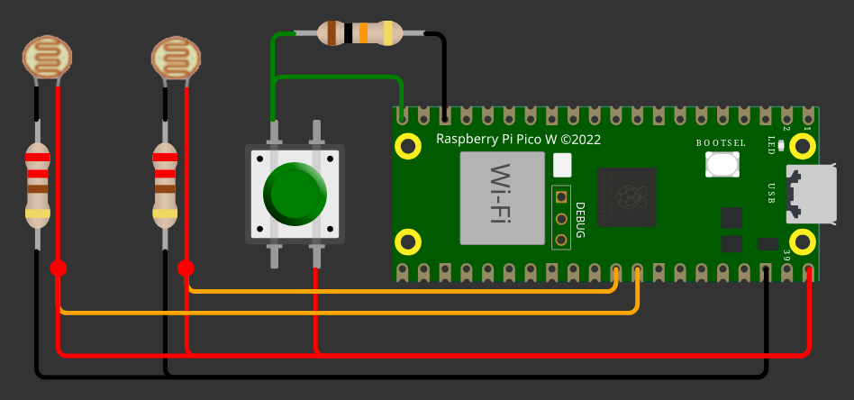

### Output
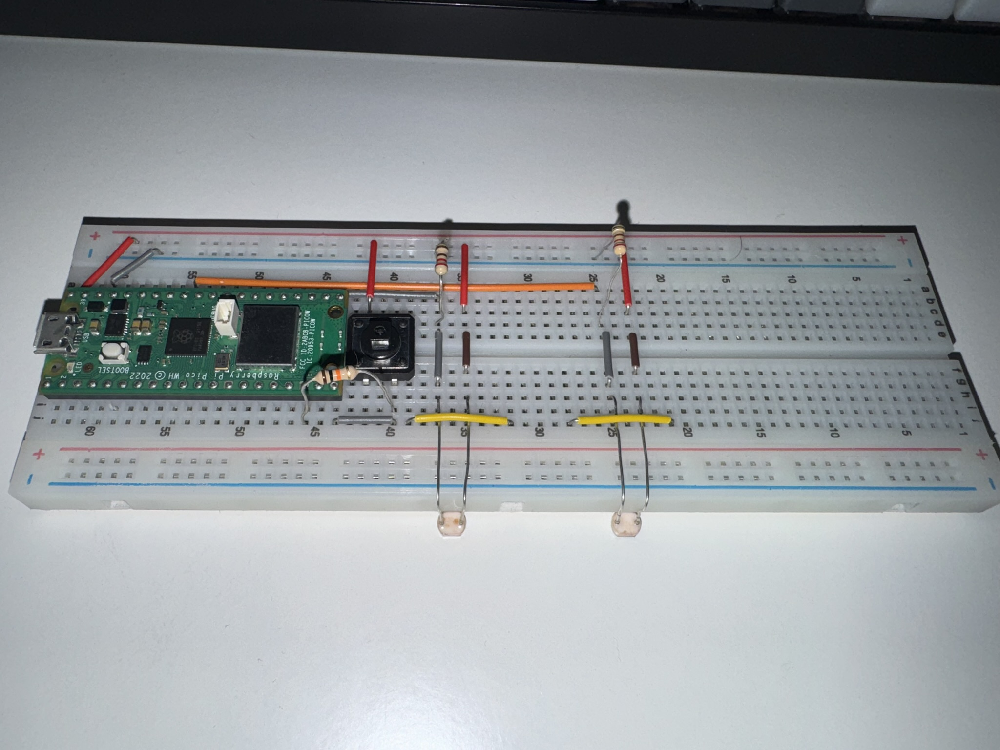

## Analog joystick (HID)

### Description

### Code
```python
import time
import board
import analogio
import digitalio
import usb_hid
from adafruit_hid.keyboard import Keyboard
from adafruit_hid.keycode import Keycode

JOYSTICK_DEADZONE_PERCENT = 10  # Deadzone for joystick input. Goes both ways so 5$ means from 45 to 55 is deadzone

# Define the pins for the input devices
x_pin = analogio.AnalogIn(board.GP26)  # A0
y_pin = analogio.AnalogIn(board.GP27)  # A1

button_pin = digitalio.DigitalInOut(board.GP15)
button_pin.direction = digitalio.Direction.INPUT

# Init keyboard object for sending input to PC
kbd = Keyboard(usb_hid.devices)

button_pressed = False
left_pressed = False
right_pressed = False
up_pressed = False
down_pressed = False

while True:
    # Read the input values
    x_value = (x_pin.value / 65535) * 100  # Scale to 0-100
    y_value = (y_pin.value / 65535) * 100  # Scale to 0-100
    button_value = bool(button_pin.value)

    # Print the joystick values for debug
    # print("X: {:.2f} Y:{:.2f} Button: {}".format(x_value, y_value, button_value))

    #determine actions
    move_left = x_value < (50 - JOYSTICK_DEADZONE_PERCENT)
    move_right = x_value > (50 + JOYSTICK_DEADZONE_PERCENT)
    move_up = y_value < (50 - JOYSTICK_DEADZONE_PERCENT)
    move_down = y_value > (50 + JOYSTICK_DEADZONE_PERCENT)
    
    if(button_value != button_pressed):
        button_pressed = button_value
        if button_pressed:
            kbd.press(Keycode.SPACE)
        else:
            kbd.release(Keycode.SPACE)

    # Joystick movement x-axis
    if move_left != left_pressed:
        left_pressed = move_left
        if left_pressed:
            kbd.press(Keycode.LEFT_ARROW)
        else:
            kbd.release(Keycode.LEFT_ARROW)

    if move_right != right_pressed:
        right_pressed = move_right
        if right_pressed:
            kbd.press(Keycode.RIGHT_ARROW)
        else:
            kbd.release(Keycode.RIGHT_ARROW)

    # Joystick movement y-axis
    if move_up != up_pressed:
        up_pressed = move_up
        if up_pressed:
            kbd.press(Keycode.UP_ARROW)
        else:
            kbd.release(Keycode.UP_ARROW)

    if move_down != down_pressed:
        down_pressed = move_down
        if down_pressed:
            kbd.press(Keycode.DOWN_ARROW)
        else:
            kbd.release(Keycode.DOWN_ARROW)

    time.sleep(0.01)  # Small delay to prevent excessive CPU usage
```

### Schematic
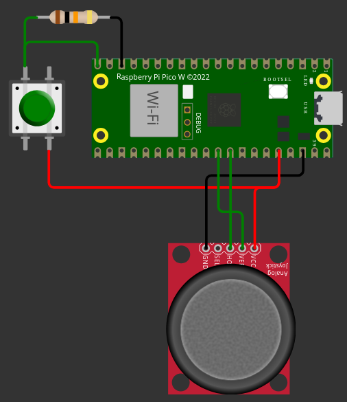

### Output
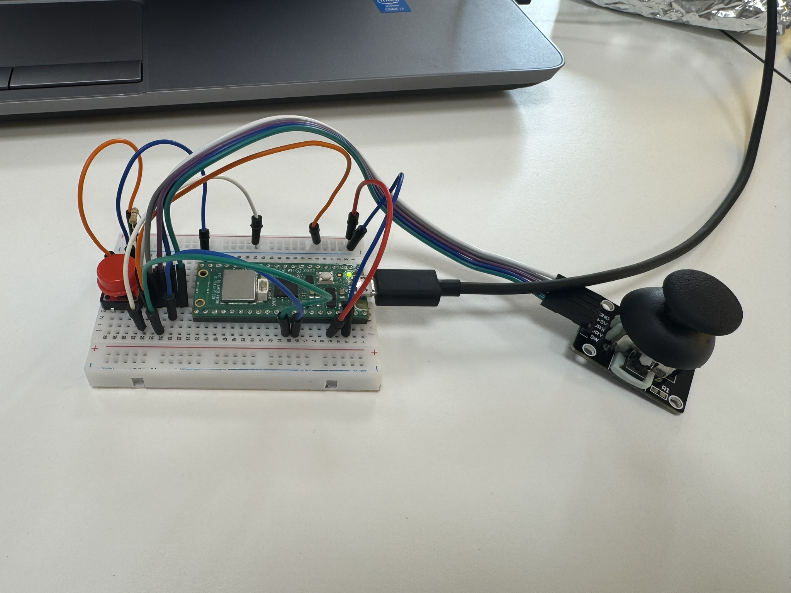

## WiFi scanner

### Description

### Code
```python

```

### Schematic
Not applicable for this project

### Output
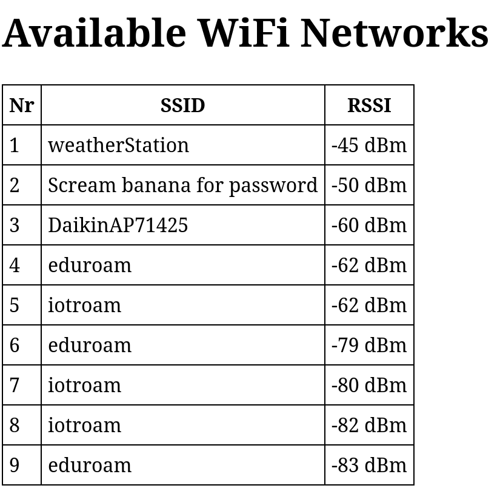

## Controlling stuff (Webserver)

### Description

### Code
```python

```

### Schematic
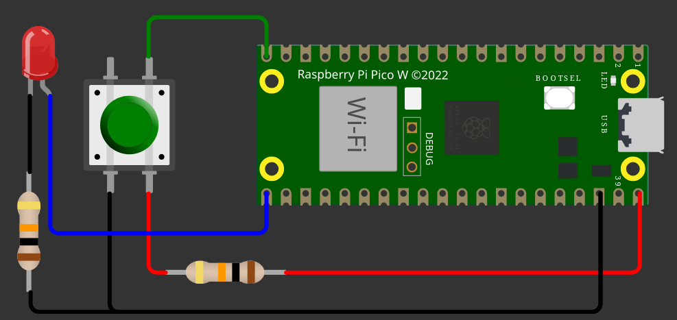

### Output
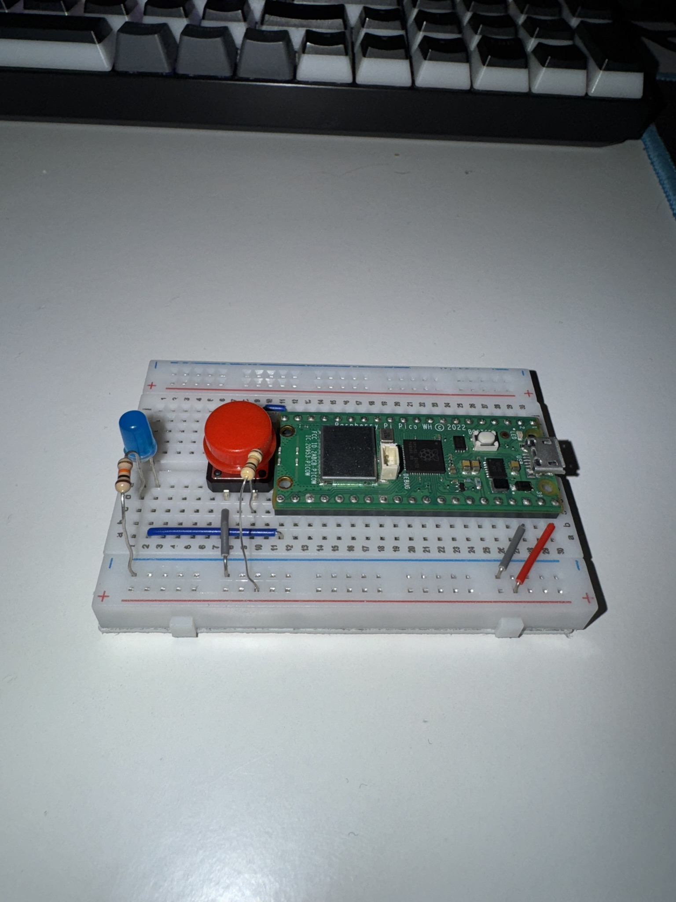
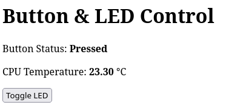

## Attendance (RFID, RTC, web and LCD)

### Description

### Code
```python

```

### Schematic
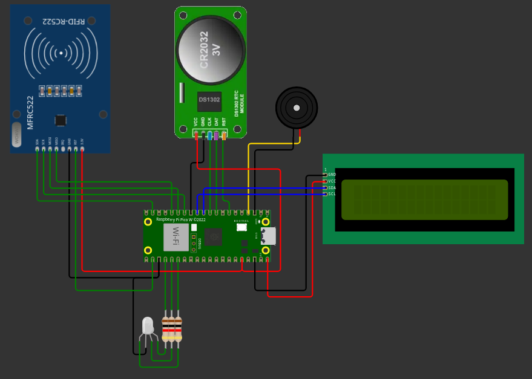

### Output
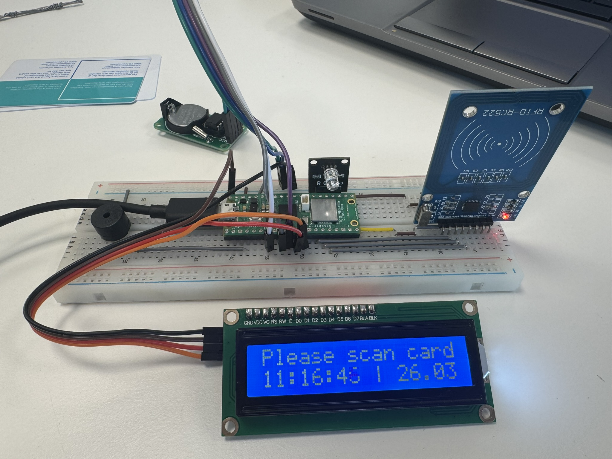
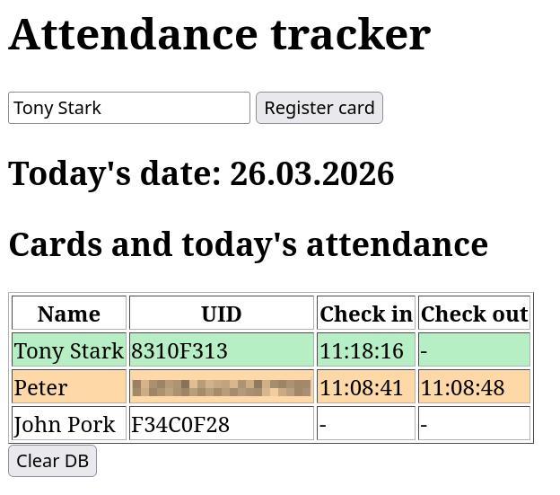
